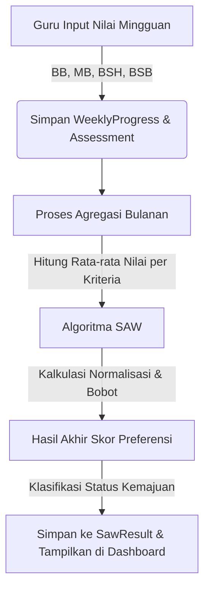

# Cara Kerja Sistem & Implementasi Metode SAW

Dokumen ini menjelaskan alur kerja sistem serta implementasi metode **Simple Additive Weighting (SAW)** yang digunakan untuk menentukan tingkat kematangan dan status perkembangan perkembangan anak (siswa) di Taman Kanak-Kanak (TK).

---

## 1. Alur Kerja Sistem (Workflow)

Sistem ini memfasilitasi penilaian berkala anak usia dini dengan tahapan berikut:



1. **Input Nilai Mingguan:** Guru memberikan penilaian kepada siswa setiap minggu pada kriteria tertentu menggunakan skala standar PAUD:
   * **BB (Belum Berkembang):** Skor 1
   * **MB (Mulai Berkembang):** Skor 2
   * **BSH (Berkembang Sesuai Harapan):** Skor 3
   * **BSB (Berkembang Sangat Baik):** Skor 4
2. **Agregasi Periode:** Karena proses penentuan status kematangan dilakukan per bulan (periode), sistem mengagregasi semua nilai mingguan dalam bulan tersebut.
3. **Kalkulasi SAW:** Sistem memproses nilai rata-rata kriteria tiap siswa menggunakan metode SAW untuk menghitung peringkat dan status perkembangan akhir.
4. **Penyimpanan Hasil:** Hasil akhir disimpan di tabel `SawResult` dan disajikan pada dashboard Admin maupun Guru.

---

## 2. Teori Metode SAW (Simple Additive Weighting)

Metode SAW sering juga dikenal dengan istilah **metode penjumlahan terbobot**. Konsep dasar metode SAW adalah mencari penjumlahan terbobot dari rating kinerja pada setiap alternatif (siswa) pada semua atribut/kriteria. 

Langkah-langkah utama dalam metode SAW:
1. Menentukan kriteria dan bobot kepentingan masing-masing kriteria ($W_j$).
2. Membuat matriks keputusan ($X_{ij}$) berdasarkan nilai alternatif pada setiap kriteria.
3. Melakukan normalisasi matriks keputusan ($R_{ij}$).
4. Menghitung nilai preferensi ($V_i$) untuk setiap alternatif.
5. Melakukan perangkingan alternatif berdasarkan nilai preferensi tertinggi.

---

## 3. Implementasi Kode Program (`/src/app/api/saw/calculate/route.js`)

Sistem mengimplementasikan metode SAW pada file `/src/app/api/saw/calculate/route.js` dengan langkah terperinci sebagai berikut:

### Langkah 1: Agregasi Nilai (Pembuatan Matriks Keputusan $X_{ij}$)
Karena siswa dinilai setiap minggu, pertama-tama sistem menghitung rata-rata nilai siswa per kriteria dalam periode (bulan & tahun) yang dipilih:

$$\text{Rata-rata } (X_{ij}) = \frac{\sum \text{Skor Mingguan Kriteria } j}{\text{Jumlah Penilaian Kriteria } j}$$

Kode JavaScript:
```javascript
progressRecords.forEach(prog => {
  const sId = prog.studentId
  prog.assessments.forEach(ass => {
    const cId = ass.criteriaId
    // Akumulasi skor dan jumlah penilaian
    studentTrack[sId].sums[cId] += ass.score
    studentTrack[sId].counts[cId] += 1
  })
})

// Menghitung rata-rata
criteriaList.forEach(c => {
  const sum = studentTrack[sId].sums[c.id] || 0
  const count = studentTrack[sId].counts[c.id] || 0
  const avg = count > 0 ? sum / count : 0
  studentAverageScores[sId][c.id] = avg
})
```

### Langkah 2: Menentukan Nilai Maksimum ($Max_j$) dan Minimum ($Min_j$)
Sistem mencari nilai rata-rata tertinggi dan terendah untuk setiap kriteria di antara seluruh siswa yang dinilai pada periode tersebut:
```javascript
if (avg > cMaxMin[c.id].max) cMaxMin[c.id].max = avg
if (avg < cMaxMin[c.id].min) cMaxMin[c.id].min = avg
```

### Langkah 3: Normalisasi Matriks Keputusan ($R_{ij}$)
Sistem menormalkan skor rata-rata berdasarkan tipe kriteria:
* **Kriteria Benefit** (Semakin besar nilai, semakin baik. Misal: aspek perkembangan motorik, kognitif, dll):
  
  $$R_{ij} = \frac{X_{ij}}{\text{Max } X_j}$$

* **Kriteria Cost** (Semakin kecil nilai, semakin baik):
  
  $$R_{ij} = \frac{\text{Min } X_j}{X_{ij}}$$

Kode JavaScript:
```javascript
if (c.type === "benefit") {
  norm = cMaxMin[c.id].max > 0 ? raw / cMaxMin[c.id].max : 0
} else {
  norm = raw > 0 ? cMaxMin[c.id].min / raw : 0
}
normalized[sId][c.id] = norm
```

### Langkah 4: Pembobotan & Perhitungan Skor Preferensi Akhir ($V_i$)
Nilai preferensi akhir ($V_i$) untuk setiap siswa dihitung dengan mengalikan matriks ternormalisasi ($R_{ij}$) dengan bobot masing-masing kriteria ($W_j$) lalu menjumlahkannya:

$$V_i = \sum_{j=1}^{n} (R_{ij} \times W_j)$$

Kode JavaScript:
```javascript
let totalScore = 0
criteriaList.forEach(c => {
  totalScore += (normalized[sId][c.id] || 0) * c.weight
})
```

### Langkah 5: Penentuan Predikat Status Kematangan
Berdasarkan nilai preferensi akhir $V_i$ (yang bernilai antara `0.0` sampai `1.0`), sistem mengklasifikasikan tingkat kematangan siswa:

| Rentang Nilai ($V_i$) | Predikat | Keterangan |
| :--- | :--- | :--- |
| $\ge 0.85$ | **Berkembang Sangat Baik (BSB)** | Anak menunjukkan kemampuan di atas standar perkembangan |
| $\ge 0.70$ | **Berkembang Sesuai Harapan (BSH)** | Anak menunjukkan kemampuan sesuai dengan tahapan usianya |
| $\ge 0.50$ | **Mulai Berkembang (MB)** | Anak mulai menunjukkan tanda kemajuan namun masih perlu diasah |
| $< 0.50$ | **Perlu Bimbingan (BB)** | Anak belum menunjukkan kemampuan awal perkembangan |

Kode JavaScript:
```javascript
let status = "Perlu Bimbingan (BB)"
if (totalScore >= 0.85) status = "Berkembang Sangat Baik (BSB)"
else if (totalScore >= 0.70) status = "Berkembang Sesuai Harapan (BSH)"
else if (totalScore >= 0.50) status = "Mulai Berkembang (MB)"
```

### Langkah 6: Penyimpanan Hasil
Hasil kalkulasi disimpan atau diperbarui (`upsert`) ke tabel database `SawResult` berdasarkan kombinasi unik `studentId` dan `period`.
